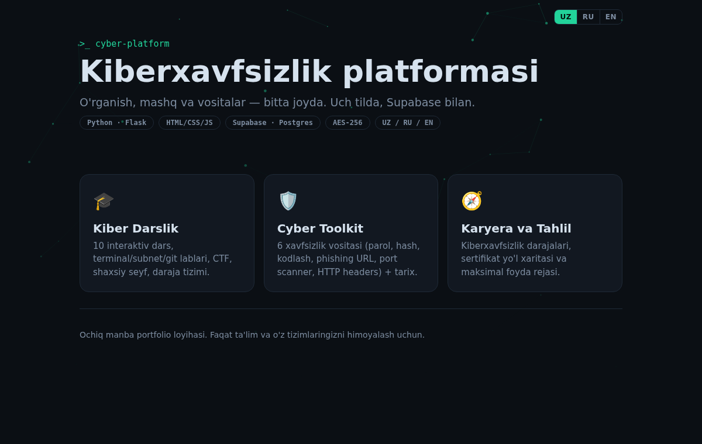
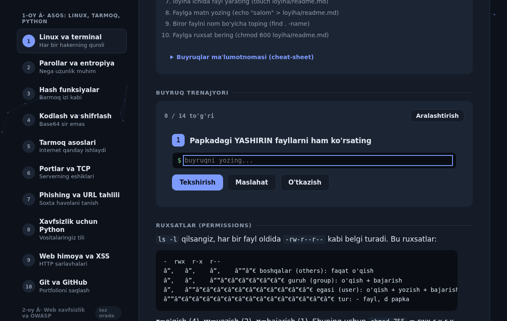
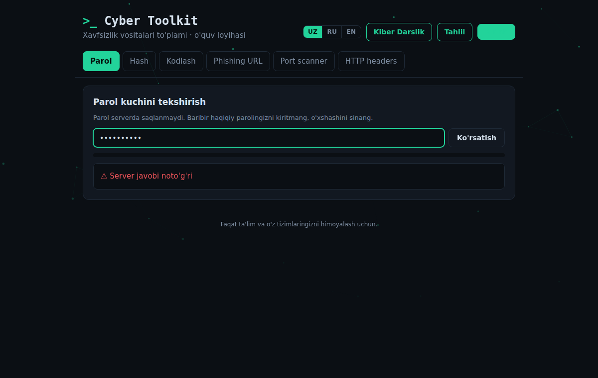
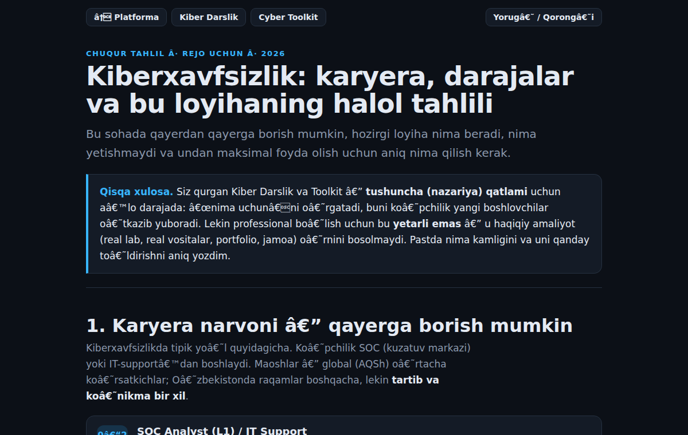

# 🛡️ Cyber Platform

> A full-stack cybersecurity learning platform — lessons, hands-on labs, security tools, and a personal vault — in **one app**, trilingual (Uzbek / Russian / English), with a **Supabase** backend for accounts and history.


Built as a portfolio project on a self-study path into cybersecurity. It combines **learning**, **practice**, and **real tools** so the concepts and the hands-on skills grow together.

---

## 📸 Screenshots

| Hub | Cyber Course |
|-----|--------------|
|  |  |

| Cyber Toolkit | Career & Analysis |
|---------------|-------------------|
|  |  |


## ✨ What's inside

The Flask app serves four sections from one program:

| Route | Section | Highlights |
|-------|---------|-----------|
| `/` | **Hub** | Landing page linking everything together |
| `/toolkit` | **Cyber Toolkit** | 6 security tools + cloud-saved history (Supabase) |
| `/darslik` | **Cyber Course** | 10 interactive lessons, hands-on labs, CTF arena, encrypted vault, levels |
| `/tahlil` | **Career & Analysis** | Cybersecurity career ladder, certification roadmap, gap analysis |

### 🛠️ Cyber Toolkit (Flask backend)
Six tools, each with real backend logic in `tools/`:

- **Password strength** — entropy, weak-pattern & keyboard-walk detection, estimated crack time
- **Hashing** — MD5/SHA/BLAKE2 generation and hash-type identification
- **Encoding** — Base64 / Hex / URL / ROT13 / Binary (encode & decode)
- **Phishing URL analysis** — look-alike brands, punycode, `@`-tricks, suspicious TLDs (never fetches the site)
- **Port scanner** — common TCP ports, **allow-listed hosts only** (`127.0.0.1`, `localhost`, `scanme.nmap.org`)
- **HTTP security headers** — grades a site's headers, with **SSRF protection** (blocks internal addresses, re-checks every redirect)

### 🎓 Cyber Course
10 lessons (Month 1): Linux & terminal, networking, Python, Git, passwords, hashing, encoding, ports/TCP, phishing, web/XSS. Each lesson has a table of contents, an **interactive lab**, a walk-through of the real project code, a cheat sheet, verified external resources, and a quiz. Labs include a **virtual terminal trainer**, a **subnet/CIDR calculator**, a **Python output-predictor**, and a **Git workflow simulator**. Plus a gamified **level system** (streak, badges, CTF arena) and an **AES-256-GCM encrypted personal vault**.

### 🔐 Security built into the app itself
Learning by example — the app practices what it teaches:

- **XSS**: every server value is escaped before rendering; strict CSP
- **SSRF**: the headers tool blocks private/internal addresses and re-checks redirects
- **Rate limiting** per IP, input validation, 64 KB request cap, `debug=False`
- **Row Level Security** on every Supabase table — users can only read/write their own rows
- **Secrets never leave the server** — only the publishable (anon) key reaches the browser, and **real passwords are never stored** (history keeps only a non-sensitive summary)

---

## 🗄️ Supabase (backend)

Accounts and per-user history are powered by Supabase (Postgres + Auth).

**Tables** (`supabase/migrations/0001_cyber_toolkit_schema.sql`):

- `profiles` — one row per user (auto-created on signup via a trigger)
- `tool_history` — saved tool results (summaries only, **no secrets**)
- `progress` — optional cloud sync of course progress

Every table has **Row Level Security**: `auth.uid() = user_id`. The frontend talks to Supabase directly with the publishable key; RLS enforces isolation.

---

## 🚀 Run locally

```bash
git clone https://github.com/<your-username>/cyber-platform.git
cd cyber-platform

python3 -m venv venv
source venv/bin/activate          # Windows: venv\Scripts\activate
pip install -r requirements.txt

cp .env.example .env               # then paste your Supabase URL + anon key
python app.py
```

Open **http://127.0.0.1:5000**

Run the tests:

```bash
pytest -q          # 24 tests
```

### Supabase setup (for accounts/history)
1. Create a free project at [supabase.com](https://supabase.com).
2. In the SQL Editor, run `supabase/migrations/0001_cyber_toolkit_schema.sql`.
3. Copy **Project URL** and the **publishable (anon) key** into `.env`.

Without Supabase keys the app still runs fully — only the sign-in / history feature is hidden.

---


## ☁️ Deploy (Render)

The repo is Render-ready (`render.yaml`, `gunicorn`).

1. Push this repo to GitHub.
2. On [Render](https://render.com): **New → Blueprint** → pick your repo (it reads `render.yaml`), **or** **New → Web Service** with:
   - Build: `pip install -r requirements.txt`
   - Start: `gunicorn app:app --bind 0.0.0.0:$PORT`
3. Add env vars **SUPABASE_URL** and **SUPABASE_ANON_KEY** in the Render dashboard.

## 🧱 Project structure

```
cyber-platform/
├── app.py                 # Flask: routes, APIs, security headers, config injection
├── config.py              # reads SUPABASE_URL / SUPABASE_ANON_KEY from env
├── tools/                 # backend logic for each security tool
│   ├── password.py  hashing.py  encoding.py
│   ├── url_analyzer.py  port_scanner.py  headers.py
│   └── errors.py          # ToolError: returns a key, frontend translates it
├── templates/
│   ├── hub.html  toolkit.html
├── static/
│   ├── style.css  app.js  i18n.js  bg.js  auth.js
│   ├── darslik.html  tahlil.html      # self-contained pages
├── supabase/migrations/   # database schema (reproducible)
├── tests/test_tools.py    # 24 tests
├── .github/workflows/ci.yml
└── requirements.txt  .env.example
```

## 🌍 How the trilingual layer works
The backend returns **keys**, not text (e.g. `{"key": "no_upper"}`, `{"error": "scan_forbidden"}`). The frontend (`static/i18n.js`) translates keys into the chosen language, so the Python code is language-agnostic — adding a language means adding a dictionary.

## ⚖️ Ethics
These tools are for **education and protecting your own systems only**. Scanning or attacking systems you don't own, without permission, is illegal. The port scanner is deliberately allow-listed.

## 📄 License
MIT — see [LICENSE](LICENSE).
